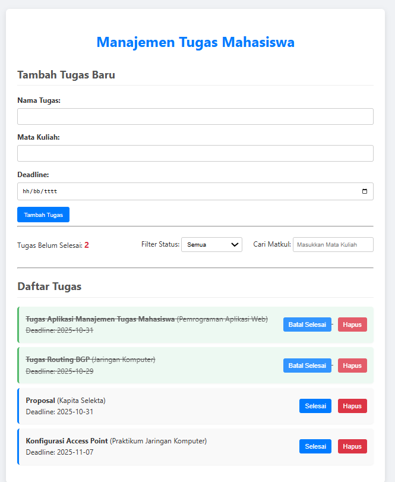
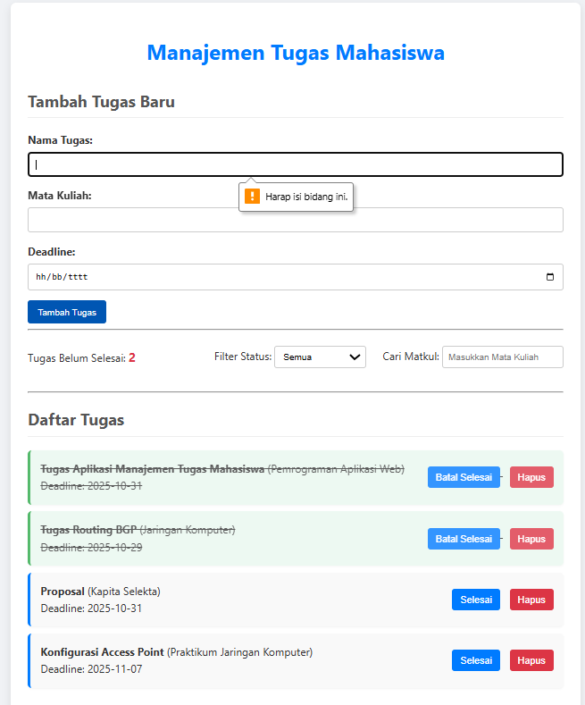
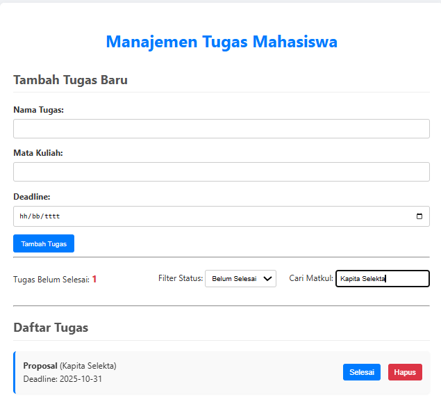

# Hanifah Hasanah - 123140082 - Tugas Praktikum Pemrograman Web
## Aplikasi Manajemen Tugas Mahasiswa

### 1. Penjelasan Singkat Aplikasi dan Fitur

Aplikasi ini adalah **Aplikasi Manajemen Tugas Mahasiswa** yang dirancang untuk membantu mahasiswa mencatat, melacak, dan mengelola tugas-tugas akademik mereka. Aplikasi ini sepenuhnya berbasis *frontend* menggunakan HTML, CSS, dan JavaScript, dengan data disimpan secara lokal menggunakan `localStorage` browser.

**Fitur Utama yang Diimplementasikan:**
* **CRUD Tasks:** Menambah, menghapus, dan memperbarui (melalui status selesai/belum selesai) tugas.
* **Penyimpanan Lokal:** Data tidak hilang saat browser ditutup atau halaman di-refresh.
* **Validasi Form:** Memastikan data input tugas valid (Nama Tugas wajib diisi, Deadline wajib diisi dan tidak boleh tanggal yang sudah lewat).
* **Filter & Pencarian:** Filter tugas berdasarkan status (Selesai/Belum Selesai) dan Pencarian berdasarkan Mata Kuliah.
* **Statistik:** Menampilkan jumlah total tugas yang **belum selesai** saat ini.

### 2. Screenshot Aplikasi

* **Screenshot 1: Tampilan Utama dengan Tugas**
    
* **Screenshot 2: Tampilan Form dengan Validasi Error**
    
* **Screenshot 3: Tampilan Hasil Filter/Pencarian**
    

*(Pastikan file gambar bernama `tampilan_utama.png`, `error_handling.png`, dan `filter_status.png` sudah ada di folder proyek Anda.)*

### 3. Cara Menjalankan Aplikasi

1.  *Clone* repository `pemrograman_web_itera_123140082` ini.
2.  Masuk ke direktori `HanifahHasanah_123140082_pertemuan3`.
3.  Buka file **`index.html`** menggunakan *web browser* (Google Chrome/Firefox).

### 4. Daftar Fitur yang Telah Diimplementasikan

| Fitur | Status | Keterangan Teknis |
| :--- | :--- | :--- |
| **Menambah Tugas** (CRUD - Create) | ✅ | Fungsi `form.addEventListener('submit')` memanggil `validateForm()` dan menambahkan objek ke array `tasks`. |
| **Menghapus Tugas** (CRUD - Delete) | ✅ | Fungsi `deleteTask(index)` menggunakan `tasks.splice(index, 1)`. |
| **Menandai Selesai/Belum Selesai** (CRUD - Update) | ✅ | Fungsi `toggleComplete(index)` mengubah properti `isCompleted` tugas. |
| **Penyimpanan Lokal** (`localStorage`) | ✅ | Menggunakan `saveTasks()` (setiap perubahan) dan `loadTasks()` (saat inisialisasi). |
| **Validasi Form** | ✅ | Fungsi `validateForm()` memvalidasi Nama Tugas (`trim() !== ""`) dan Deadline (`Date` harus >= Hari Ini). |
| **Filter Status & Pencarian Matkul** | ✅ | Logika filter/pencarian diterapkan di awal fungsi `renderTasks()`. |
| **Menampilkan Jumlah Tugas Belum Selesai** | ✅ | Variabel `pendingTasksCount` dihitung dalam *loop* `renderTasks()` dan ditampilkan pada `pending-count`. |

### 5. Penjelasan Teknis tentang Penyimpanan dan Validasi

#### Penggunaan `localStorage`

* **Kunci Penyimpanan:** Data tugas disimpan dalam `localStorage` dengan kunci `'tasks'`.
* **Penyimpanan Data:** Setiap kali data tugas diubah (ditambah, dihapus, atau status diubah), fungsi `saveTasks()` dipanggil. Fungsi ini menggunakan `JSON.stringify(tasks)` untuk mengubah array JavaScript menjadi string JSON yang dapat disimpan.
* **Pengambilan Data:** Saat halaman dimuat, fungsi `loadTasks()` menggunakan `JSON.parse(localStorage.getItem('tasks'))` untuk mengubah kembali string JSON menjadi array JavaScript (`tasks`).

#### Validasi Form

Validasi diimplementasikan dalam fungsi `validateForm(name, deadline)` di **`script.js`**:

1.  **Validasi Nama:** Memastikan nilai `name.trim()` tidak kosong. Jika kosong, pesan error ditampilkan di ``.
2.  **Validasi Deadline:**
    * Memastikan deadline terisi.
    * Membandingkan tanggal deadline yang diinput dengan tanggal hari ini (`new Date(deadline) < today`). Jika tanggal deadline sudah lewat, validasi gagal dan pesan error ditampilkan di ``.

---

**Langkah Akhir:** Anda sudah memiliki kode HTML, CSS, JavaScript, dan `README.md` yang benar. **Lanjutkan ke langkah pengumpulan** (Unggah ke GitHub) sekarang juga!