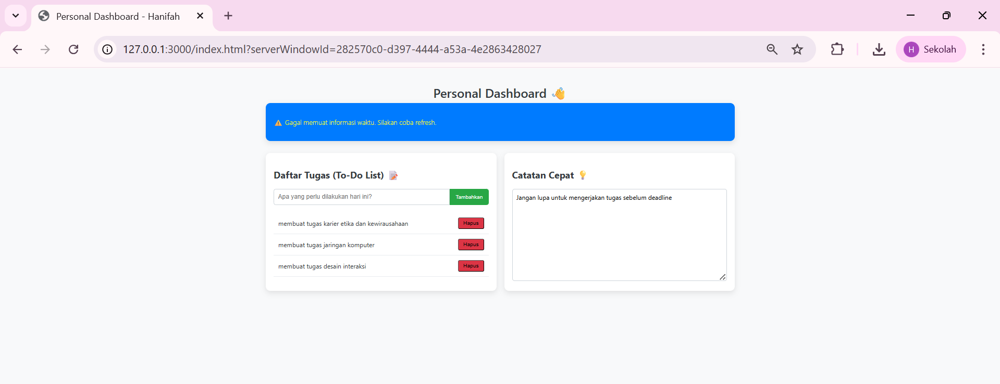
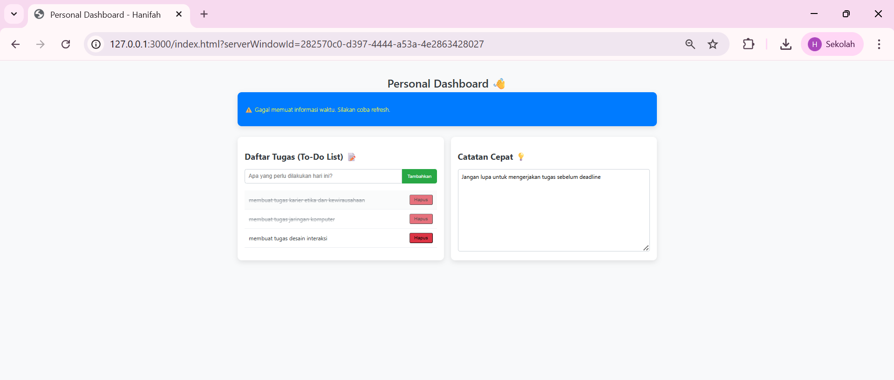

# Hanifah Hasanah - 123140082 - Tugas Praktikum Pemrograman Web
## Aplikasi Personal Dashboard

### 1. Penjelasan Singkat Aplikasi dan Fitur

Aplikasi ini adalah **Personal Dashboard** sederhana yang dirancang sebagai pusat manajemen harian. Aplikasi ini menggabungkan fitur manajemen tugas (To-Do List) dengan informasi penting secara *real-time* (Waktu Global). Seluruh data (tugas dan catatan) disimpan secara lokal menggunakan `localStorage`, dan logika program menggunakan fitur modern JavaScript (ES6+).

**Fitur Fungsionalitas Utama:**
* **To-Do List (CRUD):** Pengguna dapat menambah, menghapus, dan menandai tugas sebagai selesai/belum selesai.
* **Penyimpanan Lokal:** Data tugas dan Catatan Cepat dipertahankan menggunakan `localStorage`.
* **Informasi Dinamis (Waktu):** Menampilkan waktu global yang diambil secara asinkron menggunakan Async/Await.

### 2. Screenshot Aplikasi

* **Screenshot 1: Tampilan Dashboard Lengkap**
    

* **Screenshot 2: Tampilan To-Do List yang Interaktif**
    

*(Pastikan file gambar bernama `dashboard_main_view.png` dan `dashboard_todo_interactive.png` sudah ada di folder proyek Anda.)*

### 3. Daftar Fitur ES6+ yang Diimplementasikan

| Fitur ES6+ | Lokasi Implementasi | Keterangan Teknis |
| :--- | :--- | :--- |
| **Classes** | Class `ToDoItem` | Digunakan untuk membuat struktur objek tugas yang terorganisir. |
| **Async/Await** | Fungsi `fetchDynamicInfo()` | Digunakan untuk menangani operasi I/O asinkron (pemanggilan WorldTime API) dengan sintaks yang lebih bersih. |
| **Arrow Functions** | `saveTasks`, `renderTasks`, `taskForm.addEventListener` | Menggunakan sintaksis singkat untuk fungsi sederhana dan *callback* untuk mempertahankan *scope* `this` (meskipun tidak digunakan secara eksplisit di sini). |
| **Template Literals** | Digunakan dalam *rendering* `li.innerHTML` (`renderTasks`) dan *rendering* info waktu (`fetchDynamicInfo`). | Memungkinkan *string* multiline dan injeksi variabel (`${...}`) secara mudah dan dinamis. |
| **`let` dan `const`** | Digunakan di seluruh *script* | Digunakan secara tepat; `const` untuk variabel yang tidak berubah (e.g., kunci *storage*), `let` untuk variabel yang nilainya diubah (e.g., `tasks` array). |

### 4. Cara Menjalankan Aplikasi

1.  *Clone* repository `pemrograman_web_itera_123140082` ini.
2.  Masuk ke direktori `HanifahHasanah_123140082_pertemuan4`.
3.  Buka file **`index.html`** menggunakan *web browser* (Google Chrome/Firefox).

---