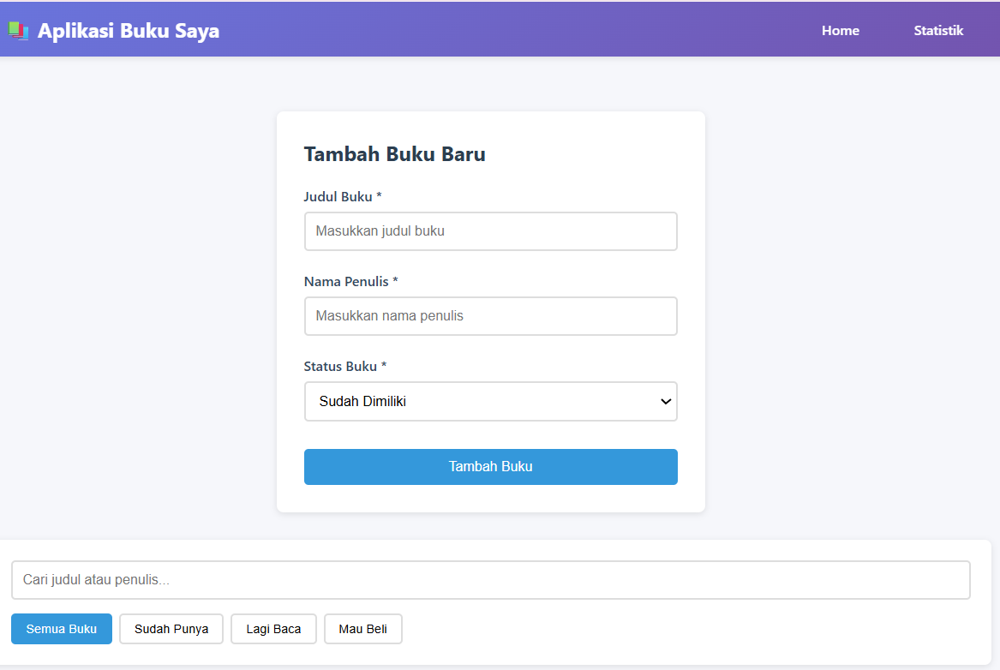
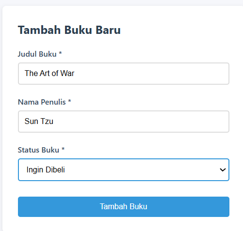
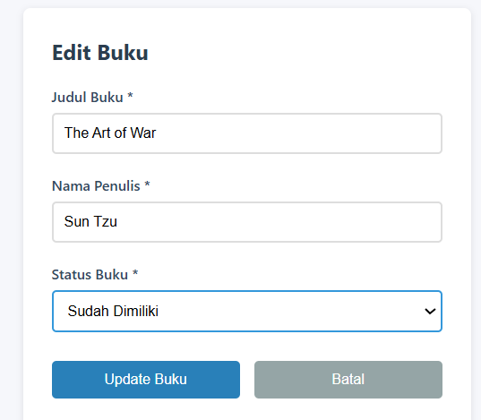
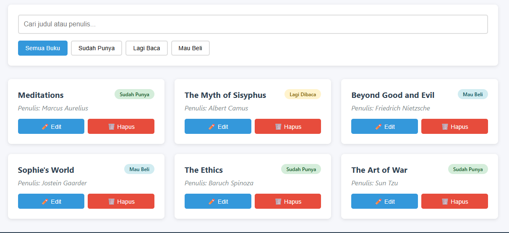
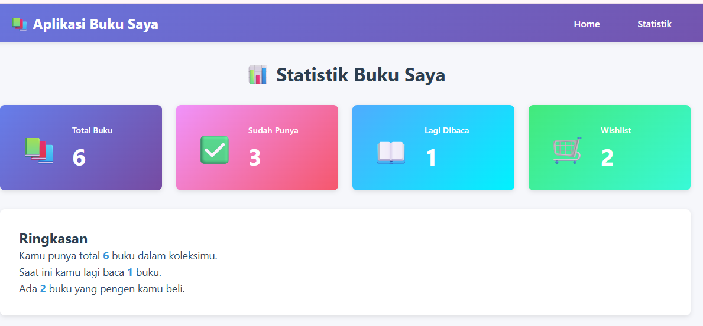

# Aplikasi Manajemen Buku Pribadi

**Nama:** Hanifah Hasanah  
**NIM:** 123140082  

## Deskripsi Aplikasi

Aplikasi ini adalah sistem manajemen buku pribadi yang memungkinkan pengguna untuk mencatat koleksi buku mereka. Pengguna dapat menambah, mengedit, menghapus, mencari, dan memfilter buku berdasarkan status (sudah dimiliki, sedang dibaca, atau ingin dibeli).

## Fitur Utama

**CRUD Buku** - Tambah, Edit, Hapus buku  
**Filter Status** - Filter buku berdasarkan status kepemilikan  
**Pencarian** - Cari buku berdasarkan judul atau penulis  
**Statistik** - Lihat ringkasan koleksi buku  
**Penyimpanan Lokal** - Data tersimpan di localStorage browser  
**Responsive Design** - Tampilan menyesuaikan ukuran layar  

## Teknologi yang Digunakan

- **React 18** - Library JavaScript untuk UI
- **React Router v6** - Routing multi-halaman
- **React Hooks** - useState, useEffect, useContext, useMemo
- **Context API** - State management global
- **localStorage** - Penyimpanan data lokal
- **CSS3** - Styling dan animasi

## Konsep React yang Diterapkan

### 1. **Component-Based Architecture**
Aplikasi dipecah menjadi komponen-komponen reusable:
- `BookForm` - Form untuk tambah/edit buku
- `BookList` - Menampilkan daftar buku
- `BookFilter` - Filter dan pencarian
- `Home` - Halaman utama
- `Stats` - Halaman statistik

### 2. **State Management**
- `useState` - Untuk state lokal di komponen
- `useContext` - Untuk state global via Context API
- `useLocalStorage` - Custom hook untuk localStorage

### 3. **Side Effects**
- `useEffect` - Sync data dengan localStorage
- Form validation dan cleanup

### 4. **Memoization**
- `useMemo` - Optimasi perhitungan statistik

### 5. **Custom Hooks**
- `useLocalStorage` - Abstraksi logic localStorage
- `useBookStats` - Kalkulasi statistik buku

### 6. **Routing**
- React Router untuk navigasi antar halaman
- Route untuk Home dan Stats

### 7. **Event Handling**
- Form submission
- Button clicks
- Input changes

### 8. **Conditional Rendering**
- Tampilan berbeda untuk empty state
- Mode edit vs mode tambah
- Filter berdasarkan kondisi

## Cara Instalasi

1. Clone repository ini
```bash
git clone <url-repository>
cd book-management-app
```

2. Install dependencies
```bash
npm install
```

3. Jalankan aplikasi
```bash
npm start
```

4. Buka browser di `http://localhost:3000`

## Cara Menjalankan Testing
```bash
npm test
```

Tekan `a` untuk menjalankan semua test.

## Struktur Folder
```
src/
├── components/
│   ├── BookForm/
│   │   ├── BookForm.js
│   │   └── BookForm.css
│   ├── BookList/
│   │   ├── BookList.js
│   │   └── BookList.css
│   └── BookFilter/
│       ├── BookFilter.js
│       └── BookFilter.css
├── pages/
│   ├── Home/
│   │   ├── Home.js
│   │   └── Home.css
│   └── Stats/
│       ├── Stats.js
│       └── Stats.css
├── hooks/
│   ├── useLocalStorage.js
│   └── useBookStats.js
├── context/
│   └── BookContext.js
├── __tests__/
│   ├── BookForm.test.js
│   ├── BookList.test.js
│   └── useLocalStorage.test.js
├── App.js
├── App.css
└── index.js
```

## Screenshot Aplikasi

### Halaman Utama


### Form Tambah Buku


### Edit Buku 


### Daftar Buku


### Halaman Statistik
 

### Hasil Testing


## Catatan Pengembangan

- Data disimpan di localStorage browser
- Aplikasi ini client-side only (tidak ada backend)
- Compatible dengan browser modern (Chrome, Firefox, Edge)

## Kesimpulan

Aplikasi ini berhasil mengimplementasikan konsep-konsep dasar React seperti component-based architecture, hooks, context API, routing, dan testing. Semua fitur berjalan dengan baik dan memenuhi requirement praktikum.

---