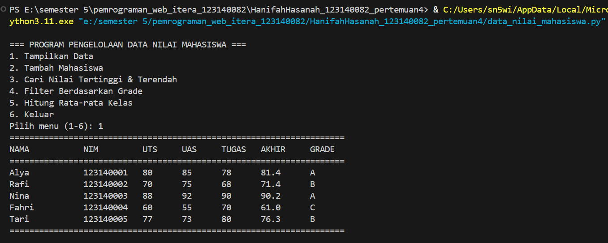
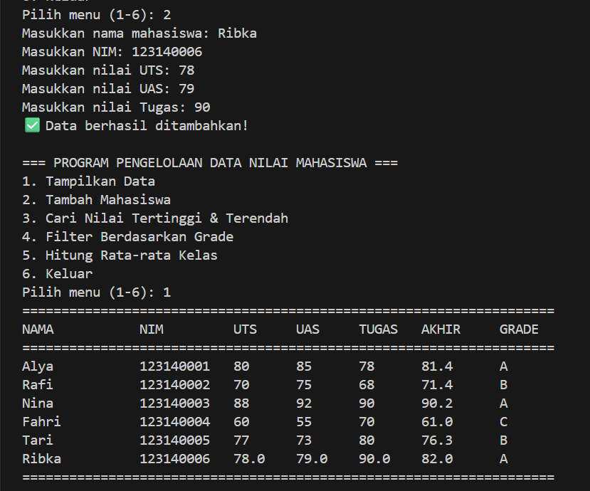
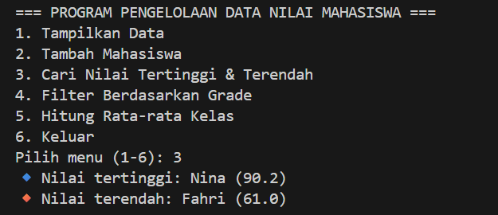
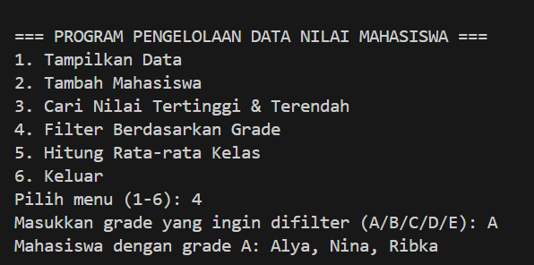
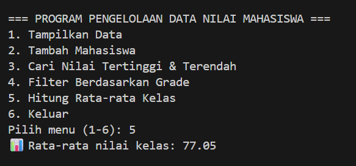

# Praktikum Pemrograman Web - Pertemuan 4

## Identitas Mahasiswa
- **Nama:** Hanifah Hasanah  
- **NIM:** 123140082  
- **Kelas:** RA  

---

## Deskripsi Program
Program ini dibuat untuk memenuhi tugas **Pertemuan 4 - Praktikum Pemrograman Web** dengan topik **Pemrograman Dasar Python**.  
Program berfungsi untuk mengelola data nilai mahasiswa, mulai dari menambah data, menampilkan, hingga mencari nilai tertinggi dan terendah.

---

## Fitur Program
1. Menampilkan daftar mahasiswa dan nilai mereka.  
2. Menambah data mahasiswa baru.  
3. Mencari nilai **tertinggi** dan **terendah**.  
4. Menampilkan **rata-rata nilai kelas**.  
5. Menampilkan **daftar mahasiswa dengan grade**.

---

## Contoh Output Program
Berikut contoh tampilan hasil program ketika dijalankan pada beberapa menu berbeda:

### 1. Menampilkan Daftar Mahasiswa dan Nilai Mereka

### 2. Menambahkan Data Mahasiswa Baru

### 3. Mencari Nilai Tertinggi & Terendah

### 4. Filter Mahasiswa dengan Grade

### 5. Menghitung Rata-rata Nilai Kelas

---
