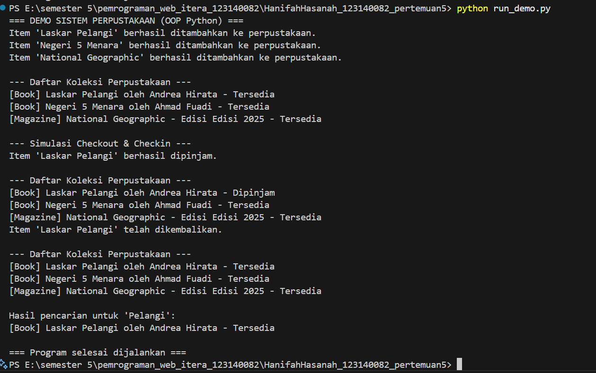

# Sistem Perpustakaan (OOP Python)

**Nama:** Hanifah Hasanah  
**NIM:** 123140082  
**Kelas:** RA

---

## Deskripsi
Program ini merupakan simulasi sederhana sistem perpustakaan berbasis **Object Oriented Programming (OOP)** menggunakan Python.  
Tujuan program ini adalah untuk memahami penerapan konsep:
- Abstract Class  
- Inheritance  
- Encapsulation  
- Polymorphism  

---

## Fitur Utama
- Menambah item baru (Book, Magazine)  
- Mencari item berdasarkan judul  
- Menampilkan seluruh koleksi item  
- Checkout dan Checkin item perpustakaan  
- Menunjukkan status item (Available / Checked Out)  

---

## Penjelasan Program
Program ini dirancang menggunakan **konsep OOP (Object-Oriented Programming)** agar struktur kode lebih terorganisir dan mudah dikembangkan.

**Konsep OOP yang Diterapkan:**
- **Abstraksi** → Menggunakan class `LibraryItem` sebagai *blueprint* dasar untuk semua item.  
- **Inheritance** → Class `Book` dan `Magazine` mewarisi dari `LibraryItem`.  
- **Encapsulation** → Atribut tertentu dilindungi dengan *access modifier* (`_protected`, `__private`).  
- **Polymorphism** → Metode `display_info()` diimplementasikan berbeda di tiap subclass.  

### Fungsi Program Utama
1. **Menambahkan Item Baru**  
   Admin dapat menambahkan buku atau majalah ke daftar koleksi.
2. **Menampilkan Koleksi**  
   Menampilkan seluruh item beserta statusnya (tersedia / dipinjam).
3. **Mencari Item**  
   Mencari item berdasarkan judul.
4. **Simulasi Checkout & Checkin**  
   Meminjam dan mengembalikan buku layaknya di perpustakaan nyata.

---

## Hasil Program
Hasil running program:



---

## Diagram Class
LibraryItem (Abstract)
│
├── Book
│ ├── title
│ ├── author
│ └── display_info()
│
└── Magazine
├── title
├── issue
└── display_info()

Library
├── _items
├── add_item()
├── show_items()
├── search_item()
└── remove_item()


---

---

## Cara Menjalankan Program

### Buka VS Code dan masuk ke folder proyek: 
pemrograman_web_itera_123140082\HanifahHasanah_123140082_pertemuan5


### Pastikan struktur folder seperti berikut:
├─ pertemuan5/
│ ├─ library_item.py
│ ├─ book.py
│ ├─ magazine.py
│ ├─ library.py
├─ main.py
├─ run_demo.py
├─ README.md

### Jalankan program di terminal:
```bash
python run_demo.py

